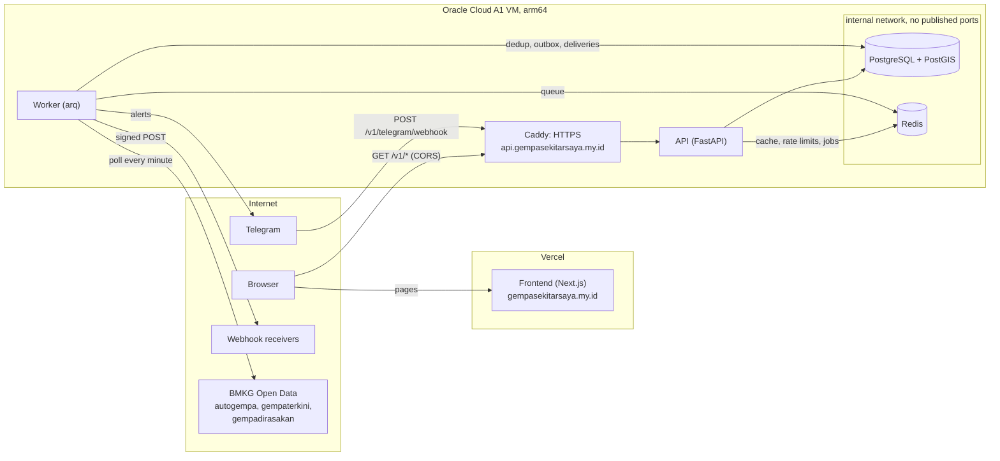

# quake-alert

Earthquake alert service for Indonesia. A worker polls BMKG Open Data, stores quakes in
PostgreSQL + PostGIS, exposes a geospatial REST API, and notifies subscribers about quakes
near them.

Earthquake data: **BMKG (Badan Meteorologi, Klimatologi, dan Geofisika)** —
<https://data.bmkg.go.id/>.

> Layanan ini tidak resmi dan hanya meneruskan data dari BMKG. Notifikasi bisa terlambat atau tidak terkirim. Untuk informasi resmi dan arahan keselamatan, ikuti BMKG (bmkg.go.id / aplikasi InfoBMKG) dan BPBD setempat.

The bot's `/start` and the footer of every frontend page show this disclaimer word for word.
In English: this service is unofficial and only forwards BMKG data; notifications can be
late or not arrive; for official information and safety guidance, follow BMKG and the local
disaster agency (BPBD).

## Live

| | |
|---|---|
| Website | <https://gempasekitarsaya.my.id> |
| API | <https://api.gempasekitarsaya.my.id> (OpenAPI docs at [`/docs`](https://api.gempasekitarsaya.my.id/docs), freshness at [`/v1/status`](https://api.gempasekitarsaya.my.id/v1/status)) |
| Telegram bot | [@infogempasekitarbot](https://t.me/infogempasekitarbot) |

_These go live with the first production deploy ([docs/deploy.md](docs/deploy.md))._

## Contents

- [Architecture](#architecture) · [Screenshots](#screenshots) ·
  [Quick start](#quick-start) · [Tests](#tests) · [Design decisions](#design-decisions-at-a-glance) ·
  [Deployment](#deployment)
- How it works: [Ingestion](#ingestion) · [Query API](#query-api) ·
  [Ingestion freshness](#ingestion-freshness) · [Telegram](#notifications-telegram) ·
  [Webhooks](#notifications-webhooks) ([receiver guide](docs/webhooks.md)) · [Frontend](#frontend)
- [Design decisions in depth](#design-decisions) · [Development](#development)

## Architecture



- **The worker** polls BMKG every minute and deduplicates quakes into PostGIS. It matches
  them to subscriptions through a transactional outbox and delivers alerts (Telegram, signed
  webhooks) as retried arq jobs.
- **The API** serves the stored history, nearby quakes (PostGIS), freshness and
  subscriptions. Redis is an optimisation for it (cache, rate limits), never a dependency of
  correctness.
- **The frontend** is static on Vercel and reads the API from the browser; CORS allows only
  its origins.
- **Only Caddy is reachable** from the internet (80, 443). PostgreSQL and Redis sit on an
  internal network with no published port.

## Screenshots

<!-- Replace with real captures after the first deploy (docs/screenshots/). -->
| Peta, 380 px, light | Riwayat, desktop, dark | Telegram alert |
|---|---|---|
| _to add: `docs/screenshots/peta-mobile.png`_ | _to add: `docs/screenshots/riwayat-dark.png`_ | _to add: `docs/screenshots/telegram-alert.png`_ |

## Quick start

Requirements: Docker, [uv](https://docs.astral.sh/uv/), Node.js 20.9+.

```sh
cp backend/.env.example backend/.env          # dev settings; CORS allows http://localhost:3000
docker compose up --build                     # PostGIS, Redis, API on :8000, worker
cd frontend && cp .env.example .env.local && npm install && npm run dev   # :3000
```

The worker starts filling the database from BMKG within a minute: `curl
localhost:8000/v1/status`. Details, including the Telegram bot in polling mode and a
synthetic test quake: [Development](#development).

## Tests

| Suite | Command | What |
|---|---|---|
| Backend | `cd backend && uv run pytest` | Unit and integration tests against a **real PostGIS and Redis** (no database mocks): dedup, matching, delivery, SSRF, rate limits, CORS, access log privacy, startup checks |
| Backend static | `uv run ruff check . && uv run ruff format --check . && uv run mypy` | Lint, format, strict typing |
| Frontend | `cd frontend && npm run lint && npm run typecheck && npm test` | ESLint, `tsc` (strict), vitest |
| Deploy | `shellcheck -x deploy/*.sh`; `docker compose -f deploy/docker-compose.prod.yml config` | Scripts and production compose file |

CI runs all of them on every push, then builds the arm64 and amd64 images on `main`.
Details: [Backend checks](#backend-checks), [Frontend checks](#checks).

## Design decisions at a glance

- [Dedup prefers duplicates over wrong merges](#dedup-prefers-duplicates-over-wrong-merges):
  a wrong merge is a missed alert, a duplicate at most a duplicate alert.
- [Transactional outbox for alerts](#from-a-new-quake-to-a-message): exactly-once matching,
  even when a job is lost.
- [Staleness is exposed, not a readiness failure](#staleness-is-exposed-not-a-readiness-failure).
- [For the API, Redis is an optimisation; the worker needs it](#for-the-api-redis-is-an-optimisation-the-worker-needs-it),
  with a circuit breaker and fail-open reads.
- [Webhook writes fail closed](#notifications-webhooks), reads fail open.
- [Webhooks connect to the IP that was checked](#webhooks-connect-to-the-ip-that-was-checked)
  (SSRF and DNS rebinding), with ownership verification before any alert.
- [A wrong manage token answers 404, not 403](#a-wrong-manage-token-answers-404-not-403).
- [Fixed-window rate limiting](#fixed-window-rate-limiting-allows-bursts-at-window-edges)
  and its edge bursts.
- [Location privacy](#frontend): the visitor's location is rounded, never stored, and never
  logged by the API or Caddy.

## Deployment

One Oracle Cloud Always Free Ampere A1 VM (arm64) runs Caddy, the API, the worker,
PostgreSQL + PostGIS and Redis with `deploy/docker-compose.prod.yml`; the frontend runs on
Vercel. CI publishes multi-arch images to GHCR. Step by step, from a fresh VM to monitoring:
**[docs/deploy.md](docs/deploy.md)**.

## Ingestion

The worker runs `poll_bmkg_feeds` every minute, on the minute, and once at startup. It
reads three BMKG feeds from `https://data.bmkg.go.id/DataMKG/TEWS/`:

| Feed                  | Contents               | Extra fields                                 |
|-----------------------|------------------------|----------------------------------------------|
| `autogempa.json`      | latest single quake    | `Potensi`, `Dirasakan`, `Shakemap` image     |
| `gempaterkini.json`   | latest 15 quakes, M5+  | `Potensi`                                    |
| `gempadirasakan.json` | latest 15 felt quakes  | `Dirasakan` (MMI felt report)                |

BMKG publishes no history endpoint, so the history is whatever this service collects.

`Potensi` is BMKG's free text, stored verbatim as `potential`. It is usually a tsunami
statement, but not always: autogempa may say "Gempa ini dirasakan untuk diteruskan pada
masyarakat" ("this quake was felt; pass it on to the public"). It must never be presented as
tsunami information.

Each poll works like this:

1. **Fetch** all feeds concurrently (`app/ingestion/bmkg_client.py`). 5xx responses,
   network errors and timeouts are retried with exponential backoff. A 4xx response, or a
   body that isn't JSON (e.g. a Cloudflare error page), fails immediately.
2. **Skip unchanged feeds.** If the sha256 of a feed's canonical JSON equals the hash of
   that feed's last *successful* run, the feed isn't processed again.
3. **Parse** into typed `QuakeReport`s (`app/ingestion/parser.py`):
   - string numbers (`"5.2"`, `"10 km"`) become numbers, exactly: BMKG's values are relayed
     as-is, so a value that can't be stored without rounding (e.g. magnitude `"5.25"` or
     depth `"10.5 km"`) makes the item malformed instead of being rounded;
   - `"lat,lon"` becomes coordinates;
   - time comes from the UTC `DateTime` field, never the local `Tanggal`/`Jam`;
   - a malformed item is logged, skipped and counted in the run's `skipped_count`.
4. **Deduplicate** (`app/ingestion/dedup.py`). BMKG has no quake ID. A report from feed F
   resolves to an existing row by the first rule that matches:
   1. **Same-feed revision:** the row already holds an F payload with the identical
      `DateTime`, **and** that payload's coordinates are within `SAME_FEED_REVISION_MAX_KM`
      (100) of the report. It is the same quake, even if coordinates or magnitude moved.
   2. **Exact fingerprint** (UTC time to the second plus lat/lon rounded to 2 decimals),
      from another feed.
   3. **Fuzzy**, from another feed: within `DEDUP_MAX_TIME_DIFF_SECONDS` (60) **and**
      `DEDUP_MAX_DISTANCE_KM` (50).

   Rules 2 and 3 never match a row that already holds an F payload, and no two items of
   one snapshot may resolve to the same row. Otherwise the report becomes a new row. See
   [Design decisions](#design-decisions) for why.

   On a match the report replaces its own feed's payload in `raw` (one entry per feed).
   All other columns are then re-derived from `raw` by feed precedence,
   **autogempa > gempaterkini > gempadirasakan**:
   - time, magnitude, location, depth and region come from the highest-precedence feed
     present;
   - `felt`, `potential` and `shakemap_url` come from the highest-precedence feed that has a
     value.

   A row therefore depends only on which payloads it holds, never on poll order. The
   fingerprint is set by the first report and never changes.

   If a row's stored payload no longer parses, that row is left as it is, the error is
   logged with the row id, and the item counts toward `skipped_count`. The rest of the run
   goes on.
5. **Record** one `ingestion_runs` row per feed: `success`, `skipped` or `failed`, with
   counts and the error. Fetches run concurrently, but feeds are processed one after
   another so the same quake from two feeds can't be inserted twice. A feed's quakes and
   its run row commit together.

A second cron job, `prune_old_records`, runs daily at 03:00 UTC:
- It deletes `success`/`skipped` ingestion runs older than `INGESTION_RUNS_RETENTION_DAYS`
  (14) and `failed` runs older than `INGESTION_RUNS_FAILED_RETENTION_DAYS` (90). It never
  deletes a feed's latest successful run, because the content-hash skip compares against it.
- It deletes `sent`/`failed` notification deliveries older than
  `NOTIFICATION_DELIVERIES_RETENTION_DAYS` (30). It never deletes `pending` ones, whatever
  their age: those are still owed to someone, and they expire on their own (see
  [From a new quake to a message](#from-a-new-quake-to-a-message)).

`tests/fixtures/bmkg/` holds real responses saved from the live API. The parser is built
and tested against them.
A regression test checks that every saved fixture still parses with the current parser,
because stored payloads are re-parsed on every merge.

## Query API

Interactive docs are at `/docs` (OpenAPI at `/openapi.json`). Every response includes a
`source` object attributing the data to BMKG (`"notice": "Sumber: BMKG"`, `url`
`https://data.bmkg.go.id/`), with `data_as_of` (see
[Ingestion freshness](#ingestion-freshness)).

| Endpoint | Returns |
|---|---|
| `GET /v1/earthquakes` | A page of earthquakes, newest first, plus `next_cursor` |
| `GET /v1/earthquakes/latest` | The most recent earthquake (404 if none yet) |
| `GET /v1/earthquakes/{id}` | One earthquake (404 if unknown) |
| `GET /v1/status` | Ingestion freshness per BMKG feed (never cached) |

Filters for `GET /v1/earthquakes` (unknown parameters are rejected with 422):

| Parameter | Rule |
|---|---|
| `lat`, `lon` | Given together. Adds `distance_km` to each result, computed by PostGIS `ST_Distance` on `geography` (geodesic, in meters, divided by 1000). |
| `radius_km` | Requires `lat` and `lon`; `0 < radius_km ≤ 1000`. Uses `ST_DWithin` on `geography`. |
| `min_mag`, `max_mag` | Inclusive; `min_mag ≤ max_mag`. |
| `start`, `end` | ISO 8601 **with offset** (naive times are rejected). `start` is inclusive, `end` exclusive. The range is at most 366 days; if only `start` is given, `end` counts as now. |
| `limit` | 1–100, default 20. |
| `cursor` | The previous page's `next_cursor`. |

```sh
curl 'localhost:8000/v1/earthquakes?lat=-2.53&lon=140.72&radius_km=300&min_mag=4'
```

Synthetic test quakes (see [Development](#try-the-whole-alert-path-with-a-fake-quake)) are
never returned by any endpoint: not listed, not `latest`, and 404 by id.

Response fields: `id`, `occurred_at` (UTC, e.g. `2026-10-01T06:24:52+00:00`), `magnitude`,
`depth_km`, `latitude`, `longitude`, `region`, `potential`, `felt`, `shakemap_url`,
`source_feeds`, `distance_km`. `potential` is BMKG's verbatim `Potensi` text and is **not**
tsunami information. Internal fields (`raw`, `fingerprint`) are never exposed.

**Pagination** is keyset-based on `(occurred_at DESC, id DESC)`. The cursor encodes the last
row of the page, and the next page holds rows strictly after it. Rows that share an
`occurred_at` are split deterministically by `id`, and quakes ingested while you page never
shift or repeat later pages.

**Caching** (Redis):
- `latest` is cached and deleted by the worker whenever ingestion inserts or updates a row.
  `CACHE_LATEST_TTL_SECONDS` (60) bounds staleness if an invalidation is ever missed.
- List queries are cached for `CACHE_LIST_TTL_SECONDS` (30). The key comes from the
  *validated* parameters, so parameter order, number spelling (`-6.2` vs `-6.20`) and
  timezone offsets of the same instant all share one entry.
- The `X-Cache` header is `HIT`, `MISS` or `BYPASS`.
- **If Redis is down**, the API answers from the database (`X-Cache: BYPASS`) and rate
  limiting is skipped. `/readyz` stays 200 and reports `"redis": "degraded"`.
  Redis calls time out after `REDIS_SOCKET_TIMEOUT_SECONDS` (0.5).
- **Circuit breaker:** all request-path Redis calls (cache and rate limit) go through an
  in-process breaker (`app/core/circuit_breaker.py`).
  - After `REDIS_BREAKER_FAILURE_THRESHOLD` (3) consecutive failures or timeouts, it opens
    for `REDIS_BREAKER_OPEN_SECONDS` (30). While open, Redis is not contacted at all, so a
    hung Redis costs a few timeouts in total instead of a timeout on every request.
  - After the open period, exactly one trial call goes through: success closes the
    breaker, failure reopens it for another full period.
  - Only state changes are logged.
  - `/readyz` bypasses the breaker on purpose: it has to probe Redis for real.
  - Breaker state is **per process**. With several uvicorn workers or API replicas, each
    one opens and recovers on its own, so a hung Redis costs up to *threshold* timeouts
    per process rather than in total. Nothing is shared or coordinated between them.

**CORS** lets the frontend read the API from the browser, and nothing more:
- `CORS_ALLOWED_ORIGINS` is a comma-separated list of exact origins
  (`https://quake.example.com`, `http://localhost:3000`): scheme, host and port, no path.
  Empty means no CORS at all. A malformed entry, or `*` in production, stops the API from
  starting.
- Only `GET` on `/v1/earthquakes*` and `/v1/status` gets CORS headers. Subscriptions, the
  Telegram webhook and the health endpoints never do, even for an allowed origin, so no
  other site's script can read their responses or preflight a write. No credentials.
- `app/core/cors.py` wraps Starlette's `CORSMiddleware` so it only sees those paths;
  `tests/integration/test_cors.py` checks allowed, rejected and look-alike origins,
  preflights, and the paths that must stay uncovered.

**Rate limiting** applies to `/v1/*` (except the Telegram webhook) only, per client IP, with a fixed window of
`RATE_LIMIT_PER_MINUTE` (60) requests per minute.
- Every response carries `X-RateLimit-Limit`, `X-RateLimit-Remaining` and
  `X-RateLimit-Reset` (seconds until the window resets).
- Over the limit, the response is `429` with `Retry-After`.
- The client IP is the socket peer. With `TRUST_PROXY_HEADERS=true` (only behind Caddy), it
  is the **last** `X-Forwarded-For` entry, the one our proxy appended. Earlier entries are
  client-controlled and ignored.

### Query plans

Measured with `EXPLAIN ANALYZE` on PostgreSQL 16 / PostGIS 3.5, using 100,000 synthetic
quakes spread over Indonesia across one year (query point Jakarta, `limit=20`):

| Query | Plan | Execution |
|---|---|---|
| `radius_km=100` (342 matches) | Bitmap Index Scan on **`ix_earthquakes_location`** (GIST) → top-N sort | 6.9 ms |
| `radius_km=1000` (~27k matches) | Bitmap Index Scan on **`ix_earthquakes_location`** (GIST), parallel heap scan → top-N sort | 151 ms |
| no filters | Index Scan on `ix_earthquakes_occurred_at_id` | 0.05 ms |
| next page (`cursor`) | Index Scan on `ix_earthquakes_occurred_at_id`, `Index Cond: ROW(occurred_at, id) < ROW(...)` | 6.4 ms |

The GIST index is used through `ST_DWithin`'s `&&` bounding-box condition, and the exact
distance check runs on the candidates it returns. Large radii cost more, because every
matching row is sorted by time before the page is cut. That is one reason `radius_km` is
capped at 1000. `tests/integration/test_query_plans.py` guards the index usage: it seeds
20k rows, runs `ANALYZE`, and asserts that the radius query plan uses
`ix_earthquakes_location` with no sequential scan.

## Ingestion freshness

`GET /v1/status` shows how current the data is, per BMKG feed:

```json
{
  "ingestion_state": "ok",
  "stale_after_minutes": 5,
  "checked_at": "2026-10-01T13:18:16.645751+00:00",
  "feeds": [
    {"feed": "autogempa", "last_success_at": "2026-10-01T13:18:12.408593+00:00",
     "last_run_status": "skipped", "last_run_at": "2026-10-01T13:18:12.408593+00:00"}
  ],
  "source": {"name": "BMKG (...)", "data_as_of": "2026-10-01T13:18:12.408593+00:00"}
}
```

- A run is **successful** if its status is `success` or `skipped`. A skipped run fetched the
  feed fine and found it unchanged, so the stored data is as current as BMKG's.
- `ingestion_state` is `ok` when every feed had a successful run within
  `INGESTION_STALE_AFTER_MINUTES` (5), otherwise `stale`. A feed that never ran is stale.
- Every `/v1/earthquakes*` response carries `source.data_as_of`: the latest successful run
  across all feeds. It is read before the data, so the data is at least that new. A cached
  response keeps the value from when it was cached (at most `CACHE_*_TTL_SECONDS` older).
- Everything is read from `ingestion_runs` in PostgreSQL, never Redis, and `/v1/status` is
  never cached.
- The worker logs `BMKG ingestion is stale` (WARNING) once when the state flips to stale, and
  `BMKG ingestion recovered` (INFO) once when it flips back. Nothing is logged per poll.
  The state lives in the worker process. A worker that starts while ingestion is already
  stale logs it once; one that starts fresh logs nothing. If the worker itself is down,
  nothing logs, which is why `/v1/status` is what external monitoring should poll.

## Notifications (Telegram)

Subscribers talk to a Telegram bot. The Bot API is called directly with httpx; there is no
SDK.

### Bot commands

| Input | Effect |
|---|---|
| `/start` | What the bot does, the commands, the disclaimer, and a "share location" button |
| Location pin | Creates the chat's subscription (radius 200 km, min M4.0), or moves it and keeps the settings |
| `/radius <km>` | Whole km, 10–1000 |
| `/minmag <value>` | 2.0–9.0, at most one decimal; `4,5` (decimal comma) is accepted |
| `/list` | Location, radius, minimum magnitude, active or not |
| `/stop` | **Hard-deletes** the chat's subscription and all its deliveries, pending ones included |

- There is one subscription per chat. Invalid arguments get the expected format back and
  change nothing.
- Only private chats are served. Group and channel messages, and update types the bot
  doesn't handle, are acknowledged and ignored.
- Everything the bot says is in Indonesian, as BMKG publishes. Wording rules: no emoji, no
  alarming words, and never "peringatan dini". `/start` includes the
  [disclaimer](#quake-alert) word for word. Tests check every text the bot can send against
  these rules, and check the disclaimer against this README.

**Privacy:**
- Coordinates are rounded to 2 decimals (about 1 km) **before** they are stored. The exact
  pin is never saved.
- Chat ids are never logged.
- `/stop` deletes everything about the chat.

### Receiving updates

**Production: webhook.** `POST /v1/telegram/webhook` only accepts requests whose
`X-Telegram-Bot-Api-Secret-Token` header equals `TELEGRAM_WEBHOOK_SECRET` (constant-time
comparison). It answers 403 otherwise, and rejects everything if no secret is configured.
- The bot's reply goes back in the HTTP response as a `sendMessage` call, which Telegram
  executes. The API process therefore never needs the bot token.
- The endpoint is not rate limited: every request comes from Telegram, and a 429 would only
  make it retry.
- A malformed update is acknowledged with 200, so Telegram doesn't redeliver it forever.

Register the webhook once:

```sh
curl "https://api.telegram.org/bot$TELEGRAM_BOT_TOKEN/setWebhook" \
  -d url=https://<your-domain>/v1/telegram/webhook \
  -d secret_token=$TELEGRAM_WEBHOOK_SECRET \
  -d 'allowed_updates=["message"]'
```

**Development: polling.** No public HTTPS URL is needed. Telegram refuses `getUpdates` while
a webhook is set, so delete the webhook first:

```sh
curl "https://api.telegram.org/bot$TELEGRAM_BOT_TOKEN/deleteWebhook"
cd backend && uv run python -m scripts.telegram_polling   # reads backend/.env
```

The script long-polls `getUpdates`, handles each update with the same code as the webhook,
and sends the replies with `sendMessage`. It refuses to run with `ENVIRONMENT=production`.

### From a new quake to a message

1. **Flag (transactional outbox).** When ingestion **inserts** a row, or **changes one of
   its derived columns** (time, magnitude, location, depth, region, felt, potential,
   shakemap), it sets `earthquakes.needs_matching = true` in the **same transaction**. An
   update that only changed `raw` (e.g. BMKG's local-time `Jam` field) flags nothing.
   After the feed commits, a `match_earthquakes` job is enqueued as the fast path.
2. **Match**, in SQL, on the rows' current values in PostgreSQL (never a cache). The job
   locks the flagged rows (`FOR UPDATE SKIP LOCKED`), matches them, and clears their flags
   in the **same transaction** that inserts the deliveries. Either both happen or neither
   does. The rule:
   `is_active AND magnitude >= min_magnitude AND ST_DWithin(sub.location, quake.location,
   radius_km * 1000)`. Only quakes whose `occurred_at` is within `NOTIFY_MAX_AGE_MINUTES`
   (30) are matched. Flagged rows older than that are cleared without notifying anyone and
   logged, so a first-run backfill of old quakes alerts nobody.
   - Each match inserts a `pending` row into `notification_deliveries`. Its
     `UNIQUE(subscription_id, earthquake_id)` with `ON CONFLICT DO NOTHING` means a row is
     alerted at most once per subscriber, however often it is re-matched.
   - That is also how **revisions** work. If BMKG raises a quake from M4.8 to M5.2, the
     re-match creates a delivery for a subscriber with `/minmag 5`. Subscribers already
     alerted at M4.8 get nothing new.
3. **Send.** There is one `deliver_notification` arq job per new delivery, with job id
   `delivery:<id>`.
   - Before sending, the job re-checks that the quake is still within
     `NOTIFY_MAX_AGE_MINUTES`. A delivery that was retried past the window is marked
     `failed` ("expired before sending"), never sent late.
   - Network errors, timeouts and 5xx are retried with exponential backoff:
     `NOTIFY_RETRY_BACKOFF_SECONDS * 2**(n-1)` (5 s, 10 s, 20 s, ...), up to
     `NOTIFY_MAX_ATTEMPTS` (5) tries.
   - On **429**, the job waits exactly Telegram's `retry_after` instead.
   - On **403** (the user blocked the bot), the subscription is deactivated and the delivery
     fails without a retry. Any later command from that chat reactivates it.
   - Any other 4xx fails without a retry.
   - After the last try the delivery is `failed`, with the error in `last_error`. It never
     stays `pending`.
   - Errors stored or logged never contain the token, which is part of every Bot API URL.
     The client builds its own messages and drops httpx's.
4. **Sweep.** Each poll starts by running the same matching on whatever is still flagged.
   A lost match enqueue (Redis failing right after a feed commit, or the worker dying) is
   therefore recovered on the next poll, exactly once, because the flag and the deliveries
   change in one transaction. The sweep runs before ingestion, so it only ever picks up
   what an earlier poll left.
   - The sweep also re-enqueues `pending` deliveries of fresh quakes, in case a delivery's
     own job was lost. The job id makes that a no-op while the job is still queued, running
     or waiting to retry.

Delivery is **at-least-once**. If Telegram accepted a message but recording `sent` failed,
the retry sends it again. Per the safety principle, a duplicate beats a missed alert.

### The message

```
Info gempa
Magnitudo: 5.2
Wilayah: Pusat gempa berada di laut 52 km BaratDaya Kab. Jayapura
Waktu: 01 Okt 2026 13:24:52 WIB
Kedalaman: 25 km
Jarak dari lokasi Anda: sekitar 120 km
Potensi (BMKG): Tidak berpotensi tsunami
Peta guncangan (shakemap): https://data.bmkg.go.id/DataMKG/TEWS/20261001132452.mmi.jpg
Sumber: BMKG (https://www.bmkg.go.id)
```

- The time is in WIB (UTC+7, no daylight saving), as BMKG publishes it.
- The distance is PostGIS `ST_Distance` on `geography`, from the subscriber's rounded
  location.
- `Potensi (BMKG)` is BMKG's text verbatim, and is omitted when BMKG gives none. It is never
  labelled as tsunami information.
- The shakemap line appears only if BMKG has one.

**Known duplicate rows.** Dedup sometimes keeps one event as two rows (see [Design
decisions](#dedup-prefers-duplicates-over-wrong-merges)). If the subscriber was already
**sent** an alert for another row within `NOTIFY_DUPLICATE_WINDOW_SECONDS` (120) **and**
`NOTIFY_DUPLICATE_DISTANCE_KM` (100), the alert is still sent, never suppressed, but with a
first line saying it may be the same event reported by another BMKG feed:

```
Catatan: mungkin kejadian yang sama dengan info gempa sebelumnya (01 Okt 2026 13:24:10 WIB), dilaporkan oleh feed BMKG lain.
```

### Out of scope / known gaps

- **No revision messages.** After an alert is sent, later changes to the same row (a revised
  magnitude, a new Potensi text, a shakemap) do not produce a follow-up message. The
  subscriber keeps the values from the first alert.
- **Possible-duplicate prefix race.** The prefix depends on an earlier alert already being
  `sent`. If the two rows are delivered at the same moment, neither gets the prefix.
- **Retention vs. idempotency.** Once a delivery is pruned (after 30 days), nothing stops
  its row from being matched again. That can't happen in practice: a row is only matched
  while its quake is at most `NOTIFY_MAX_AGE_MINUTES` old.

## Notifications (webhooks)

A webhook subscription gets a signed JSON `POST` for every matching quake. The full
receiver guide (payload, headers, verifying signatures, retries, trying it by hand) is in
**[docs/webhooks.md](docs/webhooks.md)**.

| Endpoint | Does |
|---|---|
| `POST /v1/subscriptions/webhook` | Subscribes `url` near `lat`/`lon` (`radius_km` 10–1000, `min_magnitude` 2.0–9.0) as `pending_verification`, without contacting the URL. Returns `signing_secret` and `manage_token` **once**. |
| `POST /v1/subscriptions/webhook/{id}/verify` | Sends a new challenge to a pending subscription; `active` if the receiver echoes it. `409` unless pending. Needs `Authorization: Bearer <manage_token>`. |
| `DELETE /v1/subscriptions/webhook/{id}` | Hard-deletes it and its delivery history. Needs the token. |
| `POST /v1/subscriptions/webhook/{id}/test` | Sends one signed `webhook.test` payload (no quake data) now and reports the answer. `409` while pending. Needs the token. |

**One pipeline for both channels.** Telegram and webhooks implement one `Notifier`
interface (`app/notifications/base.py`). Everything else is shared, in
`app/notifications/dispatcher.py`:
- the `needs_matching` outbox and SQL matching;
- one delivery per (subscription, quake row);
- the `NOTIFY_MAX_AGE_MINUTES` check before every attempt and retry;
- retries with backoff, and retention.

A notifier only turns an alert into one send attempt, and reports one of: sent, retry,
recipient gone (deactivate), or permanent failure.

**Ownership verification.** Anyone can type any URL into a subscription, so a new one is
`pending_verification` until its receiver proves it wants our requests:
- We send a signed `webhook.verification` request with a random 256-bit `challenge`; the
  receiver must answer `2xx` within the normal 5 s timeout with
  `{"challenge": "<same value>"}` (compared in constant time). It goes through the same
  send path as alerts, SSRF checks included, with no bypass.
- Creating a subscription never contacts the URL (only its DNS answer is checked). The
  only verification request is sent by `POST .../verify`, one per call (manage token,
  counted in the hourly write limit). Failing leaves the subscription pending. Nothing
  retries by itself.
- Pending means `is_active = false` and `verified_at IS NULL`. Matching only takes active
  rows, and a CHECK constraint makes an active, unverified webhook row impossible, so a
  pending subscription is never matched.
- The daily prune (03:00 UTC) deletes subscriptions still pending
  `WEBHOOK_PENDING_VERIFICATION_MAX_AGE_HOURS` (24) after they were created.
- The flow is create → store the signing secret in the receiver → `/verify`. A receiver
  can only check the challenge's signature once it has the secret, which the create
  response hands out; so creation sends nothing, rather than a request that a correct
  receiver would have to reject. A receiver that echoed unsigned challenges would let
  anyone verify a subscription to its URL.
- Migration `0010` turns webhook subscriptions created before verification existed into
  pending ones: they never proved ownership either.

**Webhook specifics:**
- Coordinates are rounded to 2 decimals, as for Telegram.
- The signature is `X-Quake-Signature: sha256=HMAC(secret, f"{timestamp}.{body}")`, with
  `X-Quake-Timestamp` and `X-Quake-Delivery-Id`, which stays the same on retries.
- Status codes:
  - `2xx` is sent.
  - `410` deactivates the subscription.
  - `429` retries after its `Retry-After` (delay-seconds or an HTTP date), capped at
    `WEBHOOK_MAX_RETRY_AFTER_SECONDS` (300); without a usable header, the usual backoff.
    It still uses up an attempt, and the freshness window is still checked before the
    retry.
  - Other `4xx` and `3xx` fail without retry. Redirects are never followed.
  - `5xx`, timeouts and DNS failures retry: 5 attempts with exponential backoff.
- After `WEBHOOK_MAX_CONSECUTIVE_FAILURES` (10) failed deliveries in a row, the
  subscription is deactivated, and this is logged once. A delivery whose last attempt got
  a `429` doesn't count, even when it then runs out of attempts or expires: being asked
  to slow down is not a broken endpoint. The dispatcher marks such attempts in
  `last_error` (`rate limited: ...`), so the expiry check on a later attempt knows too.
- An inactive subscription is never reactivated (`/verify` answers `409`): delete it and
  create a new one.
- Synthetic quakes are sent as `event: earthquake.test` with `synthetic: true`. The
  pipeline refuses to send any synthetic quake unless `ENVIRONMENT=development`.

**SSRF protection, with no bypass in any environment:**
- `https` only (`http` only in development).
- The host is resolved at send time, and every address must be public. Loopback, private,
  link-local, cloud metadata, carrier-grade NAT, multicast, reserved, and IPv4 embedded in
  IPv6 are all refused.
- The request connects to the vetted IP with the original Host and SNI.
- No redirects, no environment proxy, no pooled connections.
- 5 s timeouts, and at most 64 KB of the response is read.

Creating subscriptions, verifying them and sending test payloads share a stricter limit
of `SUBSCRIPTION_WRITE_RATE_LIMIT_PER_HOUR` (5) per IP, on top of the general one.

**Writes fail closed, reads fail open.** Every `POST`/`DELETE` under
`/v1/subscriptions/webhook` needs a working rate limiter. While Redis is unreachable or
the API's breaker is open, they answer `503` with `Retry-After` (the breaker's open
period, `REDIS_BREAKER_OPEN_SECONDS`) instead of skipping the limit. Reads keep failing
open. The two kinds of request carry different risks:
- A read costs us a cached response or an indexed query, and refusing it during a Redis
  outage would take quake data away from everyone. So availability wins.
- A webhook write makes **this server send a request to a URL of the caller's choosing**:
  `/verify` sends a verification request, and `/test` sends a test payload. Without the
  limit, those endpoints would be an unmetered request cannon pointed at third parties,
  and a creation flood would fill the table. Pausing subscription changes
  for a few minutes harms nobody: existing subscriptions keep receiving alerts, because the
  worker doesn't use the API's limiter. `DELETE` sends nothing, but it fails closed too, so
  the rule stays simple: every write to this resource needs the limiter.

### Signing secrets and key rotation

A signing secret must be readable to sign, so it is stored **encrypted**, not hashed:
Fernet with `MultiFernet` over `WEBHOOK_SECRET_KEYS` (comma-separated). The manage token
is only ever compared, so it is stored as a sha256 hash.

- The **first** key encrypts. **Any** listed key decrypts.
- **The API and the worker refuse to start in production without a key**, and refuse to
  start anywhere with a malformed key.
- Generate a key:
  `uv run python -c "from cryptography.fernet import Fernet; print(Fernet.generate_key().decode())"`

**Rotating a key** (subscribers notice nothing: their signing secrets stay the same, only
our encryption of them changes):
1. **Add the new key first.** Generate it, put it **first** in `WEBHOOK_SECRET_KEYS` with
   the old key(s) after it (`WEBHOOK_SECRET_KEYS=<new>,<old>`), and restart the API and
   the worker. New subscriptions are now encrypted with the new key; existing secrets
   still decrypt with the old one.
2. **Re-encrypt the stored secrets** with the same settings (both keys listed). Check
   first, then run:
   ```sh
   cd backend
   uv run python -m scripts.rotate_webhook_secrets --dry-run
   uv run python -m scripts.rotate_webhook_secrets
   # in the containers: docker compose exec api python -m scripts.rotate_webhook_secrets
   ```
   It goes through every webhook subscription (pending and inactive ones included) in
   batches of `--batch-size` (500), one transaction per batch. A secret the new key already
   decrypts is skipped, so the command is idempotent: run it again and it reports `0`
   re-encrypted. A secret no listed key can decrypt is reported by subscription id and
   left alone, and the exit code is then `1`. Secrets are never printed.
3. **Remove the old key** only once a run (or `--dry-run`) reports everything already on
   the primary key. Restart the API and the worker with `WEBHOOK_SECRET_KEYS=<new>`.

Order matters: running step 2 before every API and worker process uses the new key first
would let a process still on the old key list encrypt new subscriptions with the old key
after the run. If that happened, run step 2 again before removing the old key.

If a secret's key is removed anyway, its deliveries fail with "signing secret cannot be
decrypted"; nothing is ever sent unsigned. After 10 such failures the subscription is
deactivated.

### Webhooks: out of scope / known gaps

- **No reactivation.** A subscription deactivated by `410` or by consecutive failures stays
  inactive. Delete it and create a new one.
- **A lost manage token can't be recovered**, because only its hash is stored. Subscribe
  again; the old subscription stops on its own after 10 failed deliveries, or is
  deactivated by a `410`. A pending one is pruned after 24 h.
- **Verification proves consent once.** A URL that changes hands after verification keeps
  receiving alerts until it answers `410` or fails 10 deliveries in a row.
- **The verification request itself** still reaches an unverified URL, one per
  `/verify` call. The hourly write limit (fail closed), the public-address rule and the 5 s
  timeout bound that, and the request carries no quake data.
- **Fail-closed writes depend on the per-process breaker.** Each API process decides on
  its own whether Redis is usable, so during a partial outage some replicas may accept
  writes while others answer `503`. Each accepted write was still counted by Redis.

## Frontend

`frontend/` is a small Next.js (App Router, TypeScript strict) site in Indonesian that
reads the public API from the browser. The backend is the focus; the frontend shows its
data honestly.

| Page | Shows |
|---|---|
| **Peta** (`/`) | Recent quakes on an OpenStreetMap map (react-leaflet), sized and coloured by magnitude. A popup has magnitude, region, depth, time in WIB, "Potensi (BMKG)" verbatim, felt report, source feeds and the shakemap link. Filters: minimum magnitude and time range. "Gempa di sekitar saya" filters by the browser's location, on click only. A list under the map repeats every marker for keyboard and screen-reader users. |
| **Riwayat** (`/riwayat`) | A table with magnitude, WIB date range and an optional radius around a point (click the map or type coordinates). "Muat lebih banyak" follows the API's `next_cursor`; there are no page numbers. |
| **Cara berlangganan** (`/cara-berlangganan`) | The Telegram bot link and commands, and the webhook flow (create, store the secret, verify) with a link to `docs/webhooks.md`. |

Screenshots: [above](#screenshots).

**On every page:**
- "Data terakhir diperbarui X menit lalu", from `GET /v1/status` (refreshed every minute).
  A banner says the data may be outdated, and to check BMKG directly, when the API reports
  `stale`, when BMKG has never been read, or when `data_as_of` ages past
  `stale_after_minutes` while the page is open.
- If the API can't be reached, the page says so plainly. The map is never shown empty in
  that case, because an empty map reads as "no quakes".
- The footer has the disclaimer word for word (a test compares it with this README) and
  "Sumber: BMKG" linking to <https://www.bmkg.go.id>. No BMKG logo, no emoji, never
  "peringatan dini".
- Times are WIB with the "WIB" label, as BMKG shows them (fixed UTC+7, computed without
  relying on the browser's time zone).
- Mobile first (works at 380 px), light and dark from the system setting, labelled form
  fields, visible focus, a skip link, and text contrast of at least 4.5:1. Marker colours
  have at least 3:1 against the map (tested).

**Location privacy.** "Gempa di sekitar saya" asks for the location only when clicked. The
position is rounded to 2 decimals (about 1 km), kept in memory, and sent only as `lat`/`lon`
query parameters of the API request. Nothing is stored in the browser. On the server:
- **The location is never logged.** uvicorn's access log (full URL with the query string,
  plus the client address) is off: `--no-access-log` in `docker-compose.yml` and the
  `Dockerfile`, and silenced in `app/core/logging.py` in case uvicorn is started without
  the flag. `app/core/access_log.py` replaces it with one JSON line per request with
  `method`, `path` (never the query string), `status` and `duration_ms`. It has no query, no
  client IP and no headers.
  ```json
  {"level": "INFO", "logger": "app.access", "message": "request", "method": "GET", "path": "/v1/earthquakes", "status": 200, "duration_ms": 45.0}
  ```
  `tests/integration/test_access_log.py` sends a request with `lat`/`lon` and checks that no
  log line, of any logger, contains them or a query string. `tests/unit/test_logging.py`
  checks that uvicorn's access logger emits nothing.
- The list cache keys on the rounded parameters for 30 s, in Redis only.
- Caddy in production (`deploy/Caddyfile`) writes **no access log**. Its error log can carry
  the request, so a log filter drops the query string, the client address and credentials
  from every record. That was verified by sending `?lat=…&lon=…` through Caddy to a missing
  upstream: the logged `uri` was the bare path.

**Leaflet runs in the browser only** (`next/dynamic` with `ssr: false`): it needs `window`.
The Riwayat explorer is browser-only too, because its default range ("the last 30 days")
depends on the visitor's date, not the build's.

### Run it locally

```sh
docker compose up --build        # the API on :8000, with CORS_ALLOWED_ORIGINS=http://localhost:3000 in backend/.env
cd frontend
cp .env.example .env.local       # then edit
npm install
npm run dev                      # http://localhost:3000
```

| Variable | Meaning |
|---|---|
| `NEXT_PUBLIC_API_BASE_URL` | The API, no trailing slash, e.g. `http://localhost:8000`. The API's `CORS_ALLOWED_ORIGINS` must list the frontend's origin. |
| `NEXT_PUBLIC_TELEGRAM_BOT_URL` | The bot link on "Cara berlangganan", e.g. `https://t.me/<bot>`. |
| `NEXT_PUBLIC_REPO_URL` | The GitHub repository, for the link to `docs/webhooks.md`. |

These are inlined into the browser bundle at build time, so they are public: never put a
secret in them. On Vercel, set them in the project settings (root directory `frontend`) and
add the deployed origin to the API's `CORS_ALLOWED_ORIGINS`.

### Checks

```sh
cd frontend
npm run lint        # ESLint (next/core-web-vitals + typescript)
npm run typecheck   # next typegen + tsc --noEmit
npm test            # vitest
```

The tests cover WIB formatting and day boundaries, "X menit lalu", the magnitude scale
(bands, sizes, contrast), the API client's error handling (unreachable, timeout, 429, HTTP
errors, unexpected bodies, cancellation), cursor paging, the stale banner logic, the Riwayat
filter validation, and the footer's verbatim disclaimer.

## Design decisions

### Dedup prefers duplicates over wrong merges

Getting dedup wrong has two possible costs, and they are not equal:

| Mistake | What a subscriber experiences |
|---|---|
| Two distinct quakes merged into one row | The second quake disappears: a **missed alert** |
| One quake stored as two rows | At most a **duplicate alert** |

A missed alert is the worse failure for an alert service, so whenever the data is
ambiguous, dedup creates a new row:

- **Items in one feed snapshot are always distinct.** A feed never lists the same quake
  twice, so two items from one response never resolve to the same row, however close they
  are. Aftershock sequences are the case this protects, e.g. M5.8 then M5.1 thirty seconds
  later and 10 km away.
- **Within a feed, `DateTime` (plus a distance guard) is identity.** The same feed reporting
  the same second again, within `SAME_FEED_REVISION_MAX_KM` (100 km) of its previous
  position, is a revision and gets merged, even if the coordinates moved. The distance is
  measured from that feed's own previous coordinates, not the row's location, which may come
  from a higher-precedence feed. A different second from the same feed is a different
  quake, even within 60 s and 50 km. So is the same second more than 100 km away, since two
  unrelated quakes can share a second. A `DateTime` revision inside one feed therefore
  produces a duplicate row. That cost is accepted.
- **Fuzzy matching is only for reconciling different feeds.** Feeds describe the same quake
  with slightly different numbers. A row that already holds a payload from the incoming feed
  with a different `DateTime` is excluded, because that feed has already told us it is a
  different quake.
- **`DateTime` is compared as BMKG's own string.** If BMKG ever changed the format, the
  comparison would fail toward a duplicate, never a merge.
- **Fingerprints stay unique.** When a forced-distinct row's natural fingerprint is already
  taken (e.g. two items of one snapshot at the same second and same rounded position), the
  new row gets a salted fingerprint.

Remaining duplicate risk: one quake reported at different seconds by the same feed over
time, or reported by two feeds outside the fuzzy thresholds. Notifications therefore don't
assume rows are unique quakes. An alert for a row close in time and place to one the
subscriber already received is still sent, with a first line saying it may be the same
event (see [The message](#the-message)).

### Staleness is exposed, not a readiness failure

When BMKG is unreachable, or the worker is down, the data stops getting newer. That is not a
reason to take the API out of rotation. `/readyz` answers one question for the load
balancer: can this instance serve requests? It still can. Failing readiness on stale
ingestion would turn "the data is 20 minutes old" into "there is no data at all", for every
instance at once, because they all read the same database. Restarting API instances
wouldn't fix BMKG or the worker either.

So staleness is reported as information:
- `GET /v1/status` gives `ingestion_state` and per-feed times, for monitoring and for the
  frontend.
- Every data response carries `source.data_as_of`, so a client can show "data as of 13:18".
- The worker logs the transition to stale and back once each, for alerting on logs.

The history (what the API serves) stays correct while stale; it is just incomplete at the
recent end.

### A wrong manage token answers 404, not 403

`DELETE` and `POST .../test` answer the same `404 Subscription not found.` in all of these
cases:
- the id doesn't exist;
- the token is missing or wrong;
- the id belongs to a Telegram subscription.

A 403 for a wrong token, next to a 404 for an unknown id, would tell anyone which ids
exist. That is an oracle for probing subscriptions, and each subscription reveals someone's
approximate location. With one answer, the only way to learn anything is to hold the
token.

The lookup also does the same work either way: it hashes the presented token and compares
in constant time even when there is no row to compare against. The manage token is 256
random bits, so a fast sha256 is enough: it can't be brute-forced, and a slow password hash
would add nothing.

### Webhooks connect to the IP that was checked

The obvious SSRF check is broken. Resolving the name, checking the address, and then
handing the URL to the HTTP client makes the client resolve the name **again**.

A hostile DNS server can answer the first lookup with a public address and the second
with `127.0.0.1` or `169.254.169.254`. This is DNS rebinding, and the check never sees the
address actually used.

So the worker resolves once, rejects the request if **any** answer is non-public, and then
sends the request to that exact IP (`https://93.184.216.34/...`). It sets `Host:` and the
TLS SNI to the subscriber's hostname, so virtual hosting works and the certificate is
still verified for that hostname.

Three related measures:
- **No redirects.** A `Location` header would be a second, unchecked target.
- **No environment proxy.** A proxy would do its own resolution.
- **No connection pooling.** The pool is keyed by IP, so a pooled connection could carry
  one hostname's request over another hostname's TLS session.

The check runs again before every send, not only at subscription time, because DNS can
change at any moment.

### Fixed-window rate limiting allows bursts at window edges

The limiter counts requests per client per clock-aligned minute: one Redis `INCR` plus an
`EXPIRE` per request, a single key per client, and nothing to clean up. The cost is that the
window boundary is visible. A client can spend its whole allowance in the last second of one
window and again in the first second of the next, so up to **2 × `RATE_LIMIT_PER_MINUTE`
requests can land within about one second**. The average over any longer period still stays
at the limit.

That is acceptable here. The limit exists to keep one client from monopolising a small
read-only API, and every endpoint is served from cache or by indexed queries, so a short
2× burst is cheap. If exact smoothing ever matters (e.g. for an expensive endpoint), a
sliding-window log (a sorted set per client) or a token bucket (a small Lua script) removes
the edge burst. Both cost more Redis work per request.

### For the API, Redis is an optimisation; the worker needs it

**API.** Redis holds only things the API can live without: cached responses and rate-limit
counters. Every Redis failure degrades instead of erroring: the cache is bypassed, the rate
limit fails open for reads, and `/readyz` stays 200 with `"redis": "degraded"`. The one
exception is webhook subscription writes, which answer `503` without a limiter (see
[Notifications (webhooks)](#notifications-webhooks)): pausing them costs nobody an
alert. The circuit breaker covers the slow failure mode as well. A Redis that accepts connections but never answers
would otherwise add a timeout to every request, and after a few failures the breaker stops
calling it at all. Failing open on rate limiting during a Redis outage is a deliberate
choice: availability of quake data matters more than enforcing a per-client quota for a few
minutes.

**Worker.** The worker is different: arq *is* Redis. Its cron schedule, job queue and
retries all live there, so **while Redis is down, ingestion stops**. Notifications are
arq jobs too (matching and sending), so they stop as well. Specifically:

- The worker process exits when it loses Redis. Docker Compose restarts it
  (`restart: unless-stopped`) until Redis is reachable again. Docker backs off between
  restart attempts, so the worker can resume up to about a minute after Redis does.
  Verified locally: with Redis stopped, the worker exited and was restarted. Once Redis was
  back, the worker started and polled BMKG within about a second, because the poll job has
  `run_at_startup`.
- Missed minutes are not replayed. The first poll after recovery reads the feeds as they
  are now.

What recovery does **not** cause:

- **No double processing.** The content-hash skip compares against the last successful run
  stored in **PostgreSQL**, not Redis, so it survives the outage: unchanged feeds are
  skipped. Changed feeds go through dedup, which is idempotent. Re-reading a quake already
  stored is `UNCHANGED`, never a second row.
- **No stale alerts** (`NOTIFY_MAX_AGE_MINUTES`). Alerts are matched only for quakes whose
  `occurred_at` is within the freshness window (default 30 min), and that window is checked
  again right before sending. A quake first ingested after a long outage is stored for the
  history and the API, but not pushed to subscribers as if it were new. A delivery whose
  retries outlived the window is marked failed instead of being sent late.
- **No double alerts.** `notification_deliveries` is unique per (subscription, row) and
  lives in PostgreSQL, so re-matching after recovery creates nothing new. Rows still flagged
  `needs_matching` and deliveries left `pending` by the outage are picked up by the first
  poll's sweep while still fresh.

What an outage **can** cost:

- **Late or missing quakes.** BMKG has no history endpoint (`gempaterkini` and
  `gempadirasakan` hold the latest 15 each, `autogempa` only one), so a quake that rotates
  out of every feed during a long outage is never seen.
- **Missed alerts.** A quake older than the freshness window by the time the worker
  resumes produces no alert.

## Development

Requirements: Docker, [uv](https://docs.astral.sh/uv/).

### Run the stack

```sh
cp .env.example .env                  # optional: compose ports/credentials
cp backend/.env.example backend/.env  # app settings for running outside Docker
docker compose up --build
```

| Service  | What it does                                                      |
|----------|-------------------------------------------------------------------|
| `db`     | PostgreSQL 16 + PostGIS 3.5 (`postgis/postgis:16-3.5`, amd64; production uses `deploy/postgis` for arm64) |
| `redis`  | Redis 7: arq job queue                                            |
| `api`    | Runs `alembic upgrade head`, then FastAPI with auto-reload on :8000 |
| `worker` | arq worker (`worker.settings.WorkerSettings`)                     |

- `GET /healthz`: liveness. The process is up; no dependencies are checked.
- `GET /readyz`: readiness, for load balancers and orchestrators.
  - 200 when PostgreSQL is reachable, even if Redis is down: the API can still serve
    everything from the database.
  - 503 only when the database check fails.
  - The body reports each component: `{"db": "ok" | "error", "redis": "ok" | "degraded"}`.
  - Redis is probed directly, not through the circuit breaker, with the short
    `REDIS_SOCKET_TIMEOUT_SECONDS` timeout, so a hung Redis can't stall the probe.
- `GET /v1/status`: ingestion freshness. It is information, not a readiness signal (see
  [Design decisions](#staleness-is-exposed-not-a-readiness-failure)).

Webhook subscriptions need `WEBHOOK_SECRET_KEYS` in `backend/.env` (see
[Signing secrets and key rotation](#signing-secrets-and-key-rotation)). Without it,
`POST /v1/subscriptions/webhook` answers 503. To verify a real receiver and watch a
delivery (through a temporary HTTPS tunnel, synthetic quakes only), see "Trying it by
hand" in [docs/webhooks.md](docs/webhooks.md).

To try the bot locally, create a bot with @BotFather and put its token in `backend/.env` as
`TELEGRAM_BOT_TOKEN`. The worker uses it to send alerts. Then run the polling script (see
[Receiving updates](#receiving-updates)) and send `/start` to the bot.

If ports 5432/6379/8000 are taken on your machine, set `POSTGRES_PORT`, `REDIS_PORT` or
`API_PORT` in the root `.env`, and update the URLs in `backend/.env` to match.

### Try the whole alert path with a fake quake

`scripts/dev_fake_quake.py` inserts a **synthetic** quake near a point and runs matching. The
running worker then sends the alerts.

```sh
cd backend
uv run python -m scripts.dev_fake_quake --lat -6.21 --lon 106.85 --magnitude 5.0
```

Hard guards, all checked before anything is written:
1. `ENVIRONMENT=development`.
2. `TELEGRAM_BOT_TOKEN` is set.
3. Telegram's `getMe` says the token belongs to a bot whose username ends with `_dev_bot`
   (create a separate bot with @BotFather for development).

So a production bot's subscribers can never receive a test alert.

The synthetic row is marked `is_synthetic`:
- It is excluded from every public API response.
- Dedup never merges a real BMKG report into it. A real quake hidden inside a test row
  would be a missed alert.
- Its alert starts with `[TES - BUKAN GEMPA NYATA]`.

By default the quake is placed 10 km north of the point (`--offset-km`).

### Backend checks

From `backend/`, with `db` and `redis` running:

```sh
uv sync
uv run ruff check . && uv run ruff format --check .
uv run mypy
uv run pytest                     # unit + integration
uv run pytest -m "not integration"  # unit only, no services needed
```

Integration tests run against a real PostGIS database. `TEST_DATABASE_URL` (default
`quake_alert_test`) is **dropped and recreated** each run and migrated through Alembic.
Each test runs inside a transaction that is rolled back afterwards.

### Migrations

```sh
uv run alembic revision --autogenerate -m "describe change"
uv run alembic upgrade head
```

CI (`.github/workflows/ci.yml`) runs ruff, mypy and pytest against PostGIS and Redis
service containers, the frontend's lint, typecheck and tests, and shellcheck plus a
`docker compose config` of the production file. On `main`, once all of that passes, it
builds `quake-alert-api` and `quake-alert-postgis` for linux/arm64 and linux/amd64 and
pushes them to GHCR ([docs/deploy.md](docs/deploy.md), step 1).
